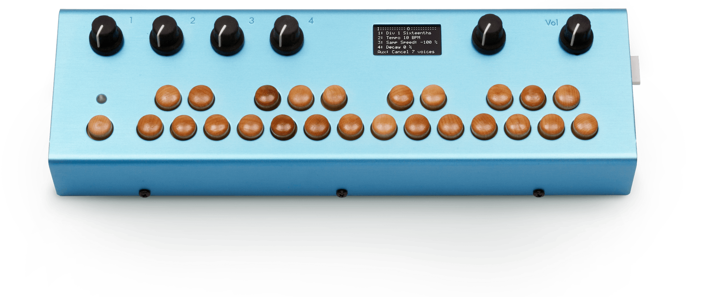

# Organelle User Manual  

First edition by Dave Linnenbank - October 2015    
  
Updated for OS v4.0 - Feb 2020

------------------------------------------------------------------------ 

# Quick-start Guide

### Let's get sound. Now! 

Welcome to the world of Organelle! You seem to be in a hurry so here is the short version for getting up and running. 

------------------------------------------------------------------------ 

## WAIT AM I IN THE RIGHT PLACE? 

Before we get started, please note that this manual is for the original Organelle 1, without a built-in speaker and battery power. Visit [this page](https://www.critterandguitari.com/manual?m=Organelle_M_Manual) if you are looking for the manual for the Organelle M.

This manual is for OS version 4.0.  You can check your OS version number from the Info menu item in the SYSTEM menu. If your hardware unit is running a version earlier than v4.0, see Chapter 7 for information on updating your Organelle OS.  

------------------------------------------------------------------------
### Package Manifest 

 Along with this card, there are two main items in the box you just opened. 

*   **Your Organelle.** Also note that a tiny USB drive is also plugged in on the right side of the unit. This drive houses the patches that will bring Organelle to musical life. 

-   **Its power adapter.** While the power supply has prongs for US-style wall sockets, it will work with input voltages from 100 to 240VAC at 50/60Hz. You may need an adapter for the shape of your wall socket. 

------------------------------------------------------------------------ 

# Getting Started 

 For the simplest configuration, follow these steps. 

1.  **First connect the power adapter to a power outlet, and then connect its plug to the leftmost port on the back of the Organelle.**  Once the Organelle is receiving power, it will begin booting up. The screen will indicate when this process is done. 

2.  **With the volume all the way down, connect your headphones or audio output.**  The knob furthest on the right of Organelle controls its output `Vol`(ume). Start with this knob all the way to the left (no sound). From the front of the Organelle, peer over the back of the unit (don't worry; the port labels will be upright from this vantage). The leftmost 1/8" jack is for headphones, and the following two 1/4" jacks are for left and right audio output, respectively. 

3.  **Load a patch.**  Immediately to the left of the volume knob is the *Selector* encoder. Turn this encoder to select one of the listed patches, and then press down the top of the encoder to load the patch.      

4.  **Play!** The wooden keys that are arranged in a piano-layout represent two octaves of notes. Play them, adjust some parameters (via the four knobs on the left), and enjoy! And if you want to try a different patch, simply turn the Selector encoder and select another patch.      

5.  **When you have had enough fun for now, properly shut down Organelle.** This is achieved by turning the Selector encoder so that the menu screen appears again. From here, scroll upward (by turning the encoder to the left) until you go past the `PATCHES` and reach the `SYSTEM` options. Select the first option, `Shutdown`, and then press down the encoder to engage this function. Finally, Organelle's display will notify you when it is safe to unplug the power supply from the unit. 

# 1. Organelle Concepts 

Again, welcome to the world of Organelle! As this instrument can work for people in many different ways and at multiple depths of operation, let us begin by getting a few ideas straight, starting with the most obvious question... 

## 1.1 What is this thing? 

We can (and will) talk about what the literal Organelle device *is*, but we'd do better to start with what it *can be*. 

### Organelle is an instrument. 

As you may have already noticed in the quick-start guide (chapter zero), Organelle can be connected quickly and is ready for sound. Other than the Organelle itself, its included USB drive and power supply, and a sound-producing device (such as headphones or an audio cable to connect to a sound system), no additional peripherals are needed for performance. 

### Organelle is an effects processor. 

In addition to audio output ports, Organelle also has an audio input port. Accordingly, patches can access and make use of incoming audio in various ways. This can range from a simple effect processor (like a filter or basic delay) to something more elaborate (like a sampler or vocoder or something else entirely). 

### Organelle is a generator. 

There is no requirement that the patches you load into Organelle are triggered by playing notes on the device. You could create patches that simply drone and/or create evolving textures on their own over time. The audio input could even be used as a source. As this definition is starting to become circular, let's cut to the chase... 

### Organelle is whatever you want it to be. 

In truth, Organelle is a vessel for your musical ideas, connecting your own desires for musical expression with customizable technology and portability. You may use Organelle in a completely different way than someone else, and that is not just okay: it's the entire point. 

### So is it hardware or software? 

In short, yes. Organelle is a hardware device that comprises both controller elements (the ports, knobs, keys, etc.) and a modern microcomputer housed inside the case. The microcomputer itself is running a version of the Linux operating system, and one use of the USB ports is to connect a drive that contains your software patches. (The USB drive included with your Organelle is preloaded with the factory patches and ready to go.) 

### What are these "patches" you speak of? 

They are files configured with the program *Pure Data*. While the term "patch" often refers to the settings and parameter values that create one sound in a synthesizer (or some other predefined system), Pure Data patches are a bit more expansive. Each patch represents the entire software system for taking any/all input received by Organelle, processing it as desired, and then delivering the output as audio, etc., via Organelle's output ports. (So by analogy, these patches are closer to both the synthesizer structure itself *and* all the settings and parameters that define its initial sound.) 

Some patches require various support files (audio media, other support patches that are being referenced, "external" objects, etc.). Any time we discuss a particular patch, it is fair to assume that we are also referencing any necessary subsidiary files. 

### What is Pure Data? And do I need to learn it to use Organelle? 

*Pure Data* (often called *Pd* for short) is a **visual** multimedia programming environment, meaning that its software files (yes, those *patches*) are created by adding objects from its library and then interconnecting them with virtual *patch cords*. For example, one simple Pure Data patch looks like this. 

 

And no, you do not need to learn Pure Data to use Organelle. Aside from the factory patches, you can also find a repository of additional patches at [organelle.io](http://organelle.io) for your perusal. You *can* customize or create your own patches, Pure Data is **free** and available for all computer platforms, but "to code or not to code" is completely up to you. 

### What other concepts may be useful to understand? 

A basic understanding of audio can only help. And MIDI (musical instrument digital interface) is the protocol for triggering *notes* and sending *control messages*. To use Organelle as is, basics are enough. If you decide to create patches, a little bit more will be required, but we will get to all that in later chapters. 

------------------------------------------------------------------------ 

## 1.2 How to Use This Manual 

 Certain chapters (such as this one!) are relevant to everyone. But depending on how you will start using Organelle, some chapters may be more valuable to you than others. 

-   Regardless of your intentions, the quick-start (chapter zero) and concepts information [Chapter 1](#1) will benefit you. 

-   If you are satisfied with the included patches alone, the information on general hardware configuration [Chapter 2](#2), system operation [Chapter 3](#3), and the factory patch listing at [organelle.io](http://organelle.io) will all be relevant to you. 

-   If you are looking to load additional patches into Organelle, then [Chapter 4](#4) will also be useful to you. (And again, visiting [organelle.io](http://organelle.io) would be a good place to start your patch search.) 

-   If you want to edit patches or even create some patches of your own, [Chapter 7](#7) will be essential. 

And do realize that your uses of Organelle are likely to change over time. If a chapter is not important to you today, don't feel bad about that: the chapters are happy to wait for you. 

# 2. The Hardware Unit 

As we begin to explore the universe that Organelle makes available to us, we should start with Organelle's place in the physical universe: its hardware. 

## 2.1 Acquainting yourself with the box. 

In this age of software and "virtual" devices, please do not neglect the hardware side of things! While its microcomputer does indeed run everything that Organelle does, we endeavored to make Organelle an "un-computer." Configuring and then interacting with the physical interface is just as critical as anything you do on the software side. In fact, this is how the pretty box can become an instrument. 

------------------------------------------------------------------------ 

### Layout of the Unit 

 Organelle is rectangular, with three of its six faces containing either controls, ports, or other interface items. We will start with the back and right-side panels (where all the ports are housed) before moving to the controls of the main face. 

#### Back Panel 

If you have turned on Organelle, then you already have some familiarity with its ports, but there is a little more here than you realize (and a little more than is labeled). 

 

Again, our orientation would be upside down if you walked around to the back of the unit and directly faced the back panel. We are assuming that you are standing in front of Organelle, just as you will be when operating it. From that position, you would access the back panel either by leaning your head forward or by tilting Organelle upward. 

-   The headphone port is an 1/8" TRS (stereo) jack. It delivers the stereo audio output of your current patch, as scaled by the `Vol`(ume) knob. 

-   The `L`(eft) and `R`(ight) `Out`(put) ports are both 1/4" TS (mono) jacks. They deliver the left and right audio outputs of your current patch, as scaled by the `Vol`(ume) knob. 

-   The single `In`(put) `LR` port is a 1/4" TRS (stereo) jack. It receives any stereo audio input that you would like fed into your current patch. 

> **NOTE:** If a 1/4" TS (mono) cable is connected, any incoming signal will only be received by the left input. 

-   The foot `Pedal` port is a 1/4" jack. It is intended to be connected to a keyboard sustain-/damper-style pedal, which will deliver on/off messages to your patch. 

> **NOTE:** Organelle presumes that any sustain/damper pedal used has a "normally closed position" (negative polarity). 

> **NOTE:** If an expression pedal is connected, your patch should  receive a continuous range of values. In our experience, various expression pedal models and settings tend to deliver different ranges of values. This can be addressed at the patch level. 

-   The HDMI port delivers the video output of Organelle's internal microcomputer. \[For additional information on using the HDMI port, see [Chapter Seven](#7).\] 

-   The microSD card slot contains a card that acts as the internal microcomputer's root disk. We recommend limiting ejecting or otherwise manipulating this card if you don't have to. But if you want to use the microSD card to store patches and free up a USB port, [check out this forum post](https://forum.critterandguitari.com/t/using-an-sd-card-for-patches/1427/4) or see our Advanced Topics page.  

-   The power port (labeled `9VDC`) is for connection to Organelle's own power supply. 

> **NOTE:** The output specifications of this power supply are: 9VDC, 1000mA, and a tip with center-positive polarity. Any power supply used with Organelle must meet these three specifications. 

#### Right-side Panel 

Compared to the back panel, the right-side panel is downright simple, housing two USB 2.0, Type A ports. Out of the box, one of these identical ports must be used for connecting a USB drive that houses your Pure Data patches (such as the one included with Organelle). They can also connect class compliant devices that utilize MIDI over USB or other computer peripherals. 

Please remember that the Type A port is indicative of a USB *host*. That is to say, the Organelle is a *host* to USB *devices* like USB-MIDI cables and WiFi adapters. Your computer is also a USB host. You cannot connect two hosts directly together! Do not purchase a special *USB A-to-A* cable to connnect the Organelle to your DAW. It won't work and you may damage your Organelle, computer, or both!
#### Main Face 

 

The main face is both Organelle's primary interface with you and the place that you will spend the most time. While the other panels are critical when Organelle is being setup or when you are altering its configuration, the main face is the operations center for when you are actively running the show. 

-   Knobs `1`, `2`, `3`, and `4` are available for parameter control within your patch. Each knob is typically assigned to a parameter that is then continuously altered across a preset range of values by movement of that knob. Movement of each knob can also send a corresponding continuous controller (CC) MIDI message. \[For information on the default MIDI operation of Organelle, see [Chapter Three](#3).\] 

-   Organelle's display provides a window into its microcomputer brain, serving as the on-board method of monitoring and adjusting both the system itself and your patches. 

-   The *Selector* encoder accompanies Organelle's display because they are dependent upon one another. While a patch is loaded, turning the Selector causes the display to show the menu screen. By leaving the Selector alone for a few seconds, the display will revert to the patch information screen. 

> **NOTE:** In some of the factory patches, the Selector encoder is used to advance through additional pages of parameter assignments. This allows you to shift the the four knobs' mappings to additional (read: more than four) parameters. Patches with this behavior are often indicated by a message like *&lt;-- HOME* in the bottom line of Organelle's on-board display. This functionality can also be built into your own patches.  

> **NOTE:**  Pressing the Selector encoder down for four (4) seconds is a shortcut to shutting down the Organelle (unless currently in a multi-page patch). 

-   The `Vol`(ume) knob governs the potential audio output level of Organelle. The knob ranges from silence (in audio terms, -∞) at the far left to no attenuation (unity gain) at the far right. Any adjustments to the Volume knob take effect immediately. 

-   The maple key at the far left and its accompanying LED comprise one special unit: the *Aux button*. By default, the Aux button does nothing, but each patch can be configured to use the input from the key for any type of mode switch or anything else. The LED has eight static states (off plus seven color options) and is generally used to provide the user with visual feedback of the Aux button's status. As with so much about patches, the function of this control will be anything the patch designer deems appropriate. 

-   After the Aux button, the 24 other maple keys work together as a group. As their piano-style layout may have indicated, these keys are for playing notes. By default, each key triggers a "note on" MIDI message when it is pressed down and a corresponding "note off" MIDI message when it is released. For patches that use note messages to trigger or affect audio output, these keys will be your primary performance vehicle. 

------------------------------------------------------------------------ 

## 2.2 A Few Configuration Ideas 

While Organelle is an open platform that permits and encourages nontraditional setups, we will now look at a few potential configurations for Organelle. Rather than suggested setups, treat these more as baselines or ideas; nearly all elements of any configuration can be mixed and matched. 

### Minimal Performance Setup 

Here we start with a variation on the setup proposed in the quick-start guide (chapter zero). This bare-bones approach is the most compact performance configuration possible. 

 

Note that the power is connected to the wall and that the first USB port has a USB drive inserted with our `Patches` folder. Without both the power adapter and USB drive attached, Organelle cannot operate and run patches, meaning that you cannot do anything of use. Accordingly, every possible configuration will contain these two items.  

> **NOTE:** If you have chosen to store your patches on the SD card, you will not need the USB drive.  

The `L`(eft) and `R`(ight) audio `Out`(put) ports are connected as a stereo pair to a mixer, which assumably runs to the venue's PA system, etc. (Instead of going straight to a mixer, these ports could just as appropriately be connected to direct boxes (DIs). If there is a sound person controlling levels, you may want to leave the Volume knob all the way up, providing maximum signal for them to work with. 

### Audio Input from a Microphone 

This example uses a microphone as an audio source for Organelle and headphones for audio output (to avoid feedback). This setup is also fairly minimal. 

 

As the audio `In`(put) `LR` port accepts a 1/4" cable, you will need something other than a regular XLR cable to use a microphone with Organelle. This could mean a cable with the appropriate connection for your microphone (probably XLR) and a 1/4" plug on the other end for Organelle, a standard XLR cable with a female XLR to 1/4" adapter attached, etc. 

As most microphones are monophonic, most patches that use audio input are likely to either sum the left and right inputs together or only use the left input. This is not problematic in and of itself, but it could affect your setup choices and expectations. 

And while we will no longer note the inevitable presence both of the power adapter and the USB drive (containing our `Patches` folder), we will observe here that our USB drive is now connected to the second USB port instead of the first one. The point is that Organelle's two USB ports are completely interchangeable. 

### A USB MIDI Controller and Audio Input from a Mixer 

This example uses powered speakers for audio output, a mixer as the source of audio input, and a USB MIDI controller to supplement Organelle's own keys and knobs. 

 

By using a mixer for Organelle's audio input, we can now use multiple audio sources with Organelle, and we can also use the mixer's various gain controls as input level adjustments for Organelle. As most mixers provide two mono outputs and Organelle has a single stereo input, you will likely need an adapter or insert cable (aka, a Y-cable) for connecting the two devices. 

In the case of using powered speakers, you need only connect each of Organelle's audio outputs to one of your speaker's inputs. 

In addition to our trusted USB drive, a MIDI controller is connected to the other USB port. Any incoming MIDI messages are sent directly to the current patch, which will determine how to use them. As long as it is class compliant, any device supporting MIDI over USB would work, whether it is an 88-key piano-style controller or a DJ-style controller, etc. Even MIDI-only controllers will work when connected to Organelle via a USB class compliant MIDI interface. 

### An External Monitor, a USB Hub, and Computer Peripherals 

This example uses headphones for audio output, a USB hub for connecting more than two devices, and an HDMI monitor for seeing Organelle's microcomputer at work. 

 

Connecting an HDMI monitor to Organelle shows the internal microcomputer's command-line interface and graphical user interface. 

Our USB drive is still connected, but it is now running through a class compliant USB hub. By adding a hub to our configuration, the number of USB devices we can connect grows to the capacity of the hub. Connecting an HDMI monitor assumes that you want to operate Organelle's microcomputer in a typical way, and this implies the use of peripherals, such as a mouse and keyboard. This necessitates the use of a USB hub. And even without using an HDMI monitor, a USB hub would be needed if you wanted to connect multiple MIDI controllers at once, etc. 

# 3. Operating the Organelle by Itself 

 As we stated early on and as the configuration ideas have shown, the Organelle is a fully capable stand-alone instrument. To use the Organelle in this fashion requires understanding the workings of its internal operating system. By learning the options provided by the Organelle's software along with the uses of the Selector encoder and the on-board display, you will be ready to travel and perform with the Organelle alone. 

In this chapter, we'll explore where this combination of the Selector and on-board display can go, and we will also go through the default MIDI operation of the Organelle and how connected USB MIDI devices interface with the Organelle. 

These topic areas will prepare you for general use of the Organelle. So let's start using it now and get the pretty box singing. 

## 3.1 Main Menu Screen 

To interface with the Organelle, we will primarily work with two of its components. The Selector encoder allows us to navigate system options and execute functions, and the on-board display shows us the choices we have and provides feedback on our current patch and system. 

When the Organelle is powered up, it first runs through its boot sequence and then drops us into its *main menu screen*. 

 

The menu screen itself comprises two sections: the system section (or system menu) at top and the patches section (or patches menu), which we see in the above image. 

The first line of the screen displays some information.  If no patch is currently playing it will say 'Select Patch'.  On the far right is a power icon.  When running from batteries you will see a battery guage indicating how many bars of power remain.  When you plug the Organelle in this changes to a flat solid bar.  To the left of the power icon is a WiFi connection icon.  When the Organelle is connected to WiFi this icon will appear.

### Patches Menu 

After the Organelle first boots up, it places us directly in the *patches section*, which is helpfully labeled **PATCHES**. By turning the Selector to the left and right, we are able to move up and down respectively in the patch list. There may be both patches or folders of patches in the Patches Menu.  Folders are designated with a '&gt;' on the right. The Organelle comes with most of the patches organized into folders.  You can always put them in your own folders, see Chapter 4 for details.  Lets navigate to the Synthesizers folder:

 

(If we scroll too far to the left, we will navigate past the patches menu and up into the system menu. In that case, simply move back down to the patches menu.)  

Then we can choose a synthesizer patch.

After the patch is successfully loaded, the Organelle's display shifts to show us the patch information screen, which we will discuss in a moment. To return to the menu screen, turn the Selector. The only difference is that the active patch is now displayed in the top line of the menu screen. 

 

### System Menu 

At the top of the menu screen is the *system menu*. The top of this section is labeled **SYSTEM**, and it contains several sub menus shown below. 

To enter one of these sub menus, follow the same procedure as loading a patch: select the desired option by turning the Selector and then pressing down on the top of the Selector. 

 

-	**Storage** contains all options related to the microSD card or USB drive, such as ejecting and reloading.

-	**Settings** accesses options for MIDI, WiFi, and Footswitch settings. It also contains system information and Favourites.

-	**Extra** may contain additional user defined functions for the Organelle.

We will discuss these menus in a moment.

## 3.2 Patch Screen 

Once a patch is loaded, you will be taken to the *patch information screen*, which serves as your main performance interface. 

The Organelle treats this as your "home screen." You can return to the menu screen by turning the Selector knob, but after a few seconds of inactivity, the Organelle will automatically return to the patch information screen. 

Below is an example image and description of a typical patch screen.  The exact information displayed on the patch screen varies widely depending on the patch, and since version 3 of the Organelle OS, patches may utilize graphical elements on the patch screen in addition to text. Please see patch documentation, such as instructions found at [the patches page](https://www.critterandguitari.com/organelle-patches), for more information.

 

On this screen, each line tends to show particular information related to the current patch. Individual patches can vary this pattern when deemed appropriate.  

-   The top line provides level meters. These are representations of the audio levels that are reaching the device's **I**(nputs) and those that are ending up at its **O**(utputs). Each meter is actually a stereo representation, with the top rows showing left levels and the bottom rows showing those for the right channels. 

> **NOTE:** The on-screen output meter is operating in a "post fader" mode, where the displayed signal is scaled based on the unit's current volume setting. 

-   The middle four lines are prefaced with **1**, **2**, **3**, and **4**, each representing that respective knob. Following the knob number is usually a short name for the parameter being altered and then a numeric representation of that parameter's current value. So in the example shown above, Knob 2 is controlling a parameter named **Vibrato Rate** that is currently set to **8 Hz**. 
-   The bottom line is prefaced with **Aux** as it tends to provide more information about the assignment and/or current state of the Aux button. In the example above, this patch seems to toggle the waveform being used an oscillator, with a **Sine Wave** currently in use. 

> **NOTE:** As was mentioned in the previous chapter, some factory patches use the Selector encoder to switch the knobs through pages of parameter assignments. In this case, the middle lines of the on-board display (starting with **1**, **2**, **3**, and **4**) will be updated as the Selector encoder is turned and the knob assignments shift. The bottom line of the on-board display may also suggest that the Aux button returns you to the *HOME* menu. 

## 3.3 System Menu Items

Lets take a closer look at the items in the System Menu.  This menu contains 3 sub menus: Storage, Settings, and Extra.  

### Storage Menu

This menu contains all options related to the microSD card or USB drive, such as ejecting and reloading.

-   **Eject** safely un-mounts an attached USB drive. The display will notify you when it is safe to unplug the USB drive. 

-   **Reload** rescans the **Patches** folder of the microSD card (or an attached USB drive) and then refreshes the Organelle's patches menu. (This also unloads the current patch so note that all sound will stop until you load another patch.) Any time that you connect a USB drive to the Organelle while the unit is already powered up, you should run this function. Once the reload process has completed, you will be left in the patches menu in order to load an available patch. 

-   **Save** stores the current parameter settings with the open patch, essentially printing the values that have been set with the knobs. Whenever this patch is reloaded, all of your previous parameters will be recalled regardless of the current knob positions. Once a knob is moved, however, its physical position will regain control. 

-   **Save New** duplicates the current patch and all of its associated files into a new patch folder and then loads that patch. The new patch also stores the parameter values of the knobs, just as the **Save** function does. When recording sound to a sampler/recorder patch, **Save New** will save the new sound(s) to the new patch and preserve the default sound(s) in the original patch. The new patch takes the name of the original patch and adds an incremented number. So triggering **Save New** while a patch named **Basic Poly** is loaded would create (and load) **Basic Poly 2**. And selecting **Save New** again with either **Basic Poly** or **Basic Poly 2** loaded would spawn **Basic Poly 3**. 

> **NOTE:** Save and Save New depend highly on the patch.  In other words, a patch must be coded to take advantage of these functions. Many of the factory patches support them, but there are also many user patches that do not.  Additionally there are many user patches that have there own mechanisms for storing and recalling presets and sounds.  

### Settings Menu

This menu accesses options for MIDI, WiFi, and Footswitch settings. It also contains system information and Favourites.

-	**MIDI Setup** See section 3.2: The Organelle's Default MIDI Setup for more information on using MIDI.

- 	**WiFi Setup** will list the networks defined in the **wifi.txt** text file.  The Organelle looks for the **wifi.txt** file on the microSD card unless a USB drive is inserted.  Click on the name of your network to join. Other options include **Start Web server**, which allows access an external computer's browser to edit files on the Organelle. **Start AP** allows the Organelle to act as its own access point. **Turn Wifi Off** severs the Organelle's connections with other networks or WiFi-enabled devices. See Section 5 for more on using WiFi with the Organelle.  See Chapter 5 for more information on WiFi

-   **Info** displays the *system information screen*, which presents information about the current hardware/software situation. Don't forget to use the *Selector* to scroll down to view more information.  The following information is displayed:

    - **CPU** The amount of processing power currently being used. We try to keep this below 75% for optimal performance. This value is updated in near-real time.

    - **USB Drive**  The ID number of the attached USB drive. When no drive is connected, nothing will be shown. 

    - **IP**				 IP Address of your Organelle to remotely add, remove or edit patches or WAV files (see Chapter 5 for using WiFi on Organelle).

    - **WiFi Network**	 Network your Organelle is currently connected to.

    - **Host Name**		 The address for accessing the web interface from a browser.

    - **Patch**			 The name of the patch currently running.

    - **Patch Folder**	The folder the patches are stored in (most likely 'Patches').

    - **User Root**		 Where Organelle is looking for patches (sdcard or usbdrive).

    - **Version** The currently installed operating system. 

-	**Pedal Setup** will help you configure your expression pedal or footswitch function. By default, a footswitch will control whatever the current patch dictates (it may not have a programmed function). If patches have been added as Favourites, a press and release of the footswitch can jump to the next patch in that list. To enable this function, select the switch option in **Pedal Setup** and then save. The **Pedal Setup** can also be used to define the beginning and end of your expression pedal's range.  Select **Expr Min** and **Expr Max** and scroll to the desired value.  Select **Save** when finished.

-	**Show Favourites** will present you with a list of any patches you have saved as a Favourite.  With **Show Favorites** selected, the full list of patches will be hidden until you select **Show Patches** in **Settings**. To add patches to the Favourites list: 

	1. Launch a patch with Encoder.
	2. Turn the encoder to **Settings** and click **Show Favourites**. 
	3. Select **Add Current** to enter a patch to the list. Patches are saved in the order they were added (not alphabetically like in the main **Patches** folder).

	To remove a patch from Favourites: 
	
	1. Launch patch you want to remove.
	2. Select **Remove Current** from the Favourites menu.

	Adding a patch to Favourites or removing it only modifies the list of Favourites - no patch files are created or deleted in this process.

> **NOTE:** Favourites is a user-currated list from all patches loaded on the Organelle's currently selected patch storage location. By default this location is the microSD card. It can also be a properly formatted USB drive (not included). If you eject a USB drive containing patches and Favourites, your Favourites will be set to the microSD card's Favourites.

### Extra Menu

This menu may contain additional user defined functions for the Organelle. Some extended techniques for the Organelle programming can be configured and accessed via the **Extras** section of the **System** menu. By default this section will be empty.

## 3.4 Organelle's Default MIDI Setup 

The way the Organelle handles MIDI will be relevant to all users, even if you are mainly pressing the unit's own maple keys to trigger note messages. There are certain default MIDI assignments in the Organelle patches that you should know. 
 
The most simple MIDI configuration is to use the 1/8" MIDI jacks to send or receive notes or MIDI clock with another instrument. By default a patch running on the Organelle will send and receive MIDI on the 1/8" jacks.  It is also possible to use class compliant USB MIDI devices.

> **NOTE:** As the Organelle is an open platform, it is possible for a patch to ignore these MIDI settings and send and receive MIDI directly as it pleases.  These are the settings by default, but if you are experiencing something different, please review any documentation about the patch you are running.

To see all available MIDI related options on the Organelle, navigate to **Settings** > **MIDI Setup**. In the MIDI Setup menu you can configure global MIDI settings.

#### Outgoing MIDI 

With the exception of the Selector knob and the Volume knob, all of the Organelle's other interface elements send out MIDI messages when they are used. All outgoing MIDI messages are sent on the MIDI channel specified in the MIDI Setup menu. 

##### The Keys 

The 24 keys (not including the Aux button on the far left) transmit "note on" messages. The leftmost key uses note number **60** ("middle C," or "C3" in most MIDI systems), and the rightmost key uses note number **83** ("B4"), with all keys in between following this scheme. 

When a key is pressed down, a "velocity" of **100** is transmitted. When a key is released, a "velocity" of **0** (zero) is sent. 

##### The Knobs 

Knobs 1, 2, 3, and 4 transmit "control change" messages using controller numbers **21**, **22**, **23**, and **24**, respectively. The full range of controller values (from **0** to **127**) is utilized. 

##### The Aux Button 

The Aux button transmits momentary "control change" messages using controller number **25**. When the button is pressed down, a controller value of **100** is transmitted. When the button is released, a controller value of **0** (zero) is sent. 

##### The Pedal Port 

A pedal connected to the Organelle's **Pedal** port transmits two sets of "control change" messages. 

Controller number **64** transmits a controller value of **0** (zero) for any received signal below **64**, and a controller value of **127** is sent for any received signal of **64** or above. This discrete, threshold behavior is particularly good for sustain-/damper-style pedals. 

Controller number **26** transmits continuous values. While the general range would be from **0** (zero) to **127**, the exact range of values may vary based on the pedal connected. This continuous behavior is ideal for an expression-type pedal. 

No matter what type of pedal is connected, both of these control change messages will be transmitted, and there is nothing stopping you from using both sets of messages. 

#### Incoming MIDI Messages 

In general, the MIDI messages that are output by the Organelle (as outlined in the immediately previous section) are identical to the incoming messages recognized by the Organelle. This can be helpful, for example, if you want to record the movement of the Organelle's controls into a sequencer as automation data. In other words, the mappings are a bit of a mirror. So let's take particular note of how incoming MIDI messages interact with and can sometimes override the Organelle's on-board controls. 

And similar to the outgoing messages, incoming messages should be sent to the Organelle on MIDI input channel specified in the MIDI Setup menu. 

##### Note On Messages 

Incoming note messages can happen concurrently with note messages created by playing the Organelle's keys. If incoming and internal notes are occurring at the same time, these two streams are essentially merged together. 

##### Control Change Messages 

Incoming "control change" messages using controller numbers **21**, **22**, **23**, and **24** replace the current values set by Knobs 1, 2, 3, and 4, respectively. 

**To restore a knob's control:** simply turn the knob enough to register a new value. In the same way that "control change" messages are designed to work, the dominant message is always the last one received. 

Incoming "control change" messages using controller number **25** affect the internal status of the Aux button. A controller value between **64** and **127** simulates the Aux button being pressed down, while a controller value between **0** (zero) and **63** simulates a release of the Aux button. 

> **NOTE:** A momentary control source, such as a damper pedal or button, would work well with this sort of threshold behavior. In certain situations, controlling the Aux button from a external "sustain" pedal could be quite effective. 

Incoming "control change" messages using controller number **26** replace the current value used by the Organelle for an expression-style pedal. And incoming messages using controller number **64** replace the current value used by the Organelle for a sustain-/damper-style pedal. (This subtle distinction really only matters if you are making your own patches.) Similar to the knobs, using the pedal will reactivate it as the current control source, updating both controllers **26** and **64**. 

##### Program Change Messages 

Incoming "program change" messages are used to select the Organelle's current patch from the list of Favourites. 

Patches are stored in the Favourites list in the order they are added. Each patch is then dynamically assigned a "program number" based on its position. Let's say the Organelle had three patches added to Favourites in this order: **Proton Patch**, **Water Patch**, and **Acid Patch**. Sending the Organelle program number **1** would call up **Proton Patch**, program number **2** would call up **Water Patch**, and program number **3** would call up **Acid Patch**. (Since these are the only three patches in Favourites, program change messages for numbers **4** and above would do nothing.) If you have only one patch in Favourites, program number **1** will not cause a change.

##### Other MIDI Messages 

Any other MIDI message is passed directly to the current patch. If the patch is configured to handle that particular message, it will respond as configured. If the patch is not listening for that message, then nothing will happen. 

### Using a USB MIDI Device 

 Using a USB MIDI device with the Organelle is rather painless but not "hot swappable." 

1.  **Connect your USB MIDI device.** As long as a USB MIDI device requires no special, proprietary driver, you need only to connect it to the Organelle. This can be done via a USB port either on the Organelle itself or on a USB hub that is connected to the Organelle. 

2.  **Select the MIDI device in MIDI Setup** In the MIDI menu select **Device**.  You can now scroll through a list of MIDI devices (if you have connected more than one, they will all be on the list).  The device name usually contains the manufacturer or model number. Press the encoder to make your selection, then select **Save**.
 
3.  **Load the patch you want to use. If it was already loaded, please reload it.** Reload the patch for the settings to take effect. 

That's about it. By remembering to reload your patch and knowing what MIDI messages are understood by the Organelle (see the immediately previous section) and/or those understood by the particular patch you have loaded, you should be all set to use MIDI with the Organelle. 

------------------------------------------------------------------------ 

# 4. Managing Patches 

### Bringing additional patches from your computer to Organelle. 

One of the strengths of the Organelle is its depth. Included on your Organelle's microSD card are numerous patches that use the instrument in a plethora of fashions. These included factory patches represent what is possible with the Organelle, but are by no means the only patches you can use. 

As was mentioned in an earlier chapter, [the patches page](https://www.critterandguitari.com/organelle-patches) is the official repository of the Organelle patches. It is a great place to start when looking for new sounds, options, and performance approaches. In addition [Patch Storage](http://www.patchstorage.com) is a website that hosts many user created patches for the Organelle and also other open platforms. 

The Organelle can load patches from the internal microSD or a USB drive inserted into one of the USB ports on the side.  When you power up the Organelle (or choose **Reload** from the Storage menu), the Organelle will first check if a USB drive is present and contains patches.  If there is no USB drive, the Organelle will check the internal microSD card and use the patches there.

Finding and downloading Organelle-ready patches is easy enough. To use these patches, we need to get them from a computer to the Organelle's microSD card or USB drive. (And yes, that computer could be running Windows, Macintosh, Linux, or some other operating system. No additional software is required; the computer is just being used to download files, possibly decompress them, and then copy their folders to your Organelle.) 

Getting patches on a USB drive is simply a matter of inserting the drive in a computer and copying over the files.  To use the internal microSD card we need to connect to the Organelle over WiFi and transfer them using a web browser interface.  

## 4.1 Folder Structure 

Whether the Organelle is loading patches from the microSD card or USB drive, the patches have the same folder structure.  The patches live in a folder named **Patches** at the top level of either the microsD or USB drive.  Each patch is a folder itself and each patch's folder must contain a file named **main.pd**. A patch might require other files, such as sounds or sequences or sub patches, and these will all reside in the patch folder.

An example folder listing would start like this. You can see here at least four patches, each with a required **main.pd** file. 

    Patches/
		32 Oscillators/
			main.pd
		Analog Style/
			blsaw.pd
			distort.pd
			main.pd
			sequencer2.pd
			simple.pd
		Arpeggio - Double/
			counter-down.pd
			counter-up.pd
			counter-updown.pd
			delay2sec.pd
			main.pd
			master-metronome.pd
			sequencer2.pd
		Basic Poly/
			main.pd
			voice.pd 
			...

It is also possible to place patches in sub folders.  Generally a sub folder is a folder that contains other patch folders.  A sub folder should not have any additional files.  This is useful for organizing your patches into categories, for example Synthesizers or Effects.

## 4.2 Using a USB Drive for Patches

As has probably become clear by now the Organelle comes loaded with patches on the internal microSD card. A set of patches separate from that of the microSD card can also be loaded on a USB drive and used.

To have the Organelle load patches from the USB drive, the drive must either be connected to the Organelle before it powers up, or inserted while it is running.  If you insert a USB drive while running, you must select **Reload** in the Storage menu to refresh the list of patches.   

### General Information 

An attached USB drive must be appropriately configured. 

-   This USB disk should be formatted with a FAT file system, often associated with MS-DOS. This is most often the default for small USB flash drives.

-   This USB drive must contain a folder called **Patches** at its top-level. (This name is case-sensitive.)  
  
### Working with your USB Drive on a Computer 

Rather than guide you through web browsing, we will assume that you have already downloaded some new patches either from [the patches page](https://www.critterandguitari.com/organelle-patches) or [Patch Storage](http://www.patchstorage.com) or another source. 

From here, we need to connect the USB drive you are using with the Organelle to your computer. **If the USB drive is currently connected to the Organelle, properly **Eject** the disk before removing it.** Select **Eject** from the Storage menu. Once the drive is connected and seen by your computer, we can proceed. 

### Folder Structure Revisited 

Earlier in this chapter, we went over the required folder structure for a usable USB drive. Now that the drive is connected to a computer, let's see the same structure in a more familiar, graphical view. 

 

The top-level of my USB drive, whose disk name is **ORGANELLE**, is shown above. Inside of the top-level **Patches** folder, the folders for the first four patches are selected (with blue coloration), and their contents are exposed. 

Again, the requirement here is that each folder contains a **main.pd** file that serves as the primary file for that patch. As long as this file is in place, that patch will appear in the Organelle's patches menu as the folder name. So in the example shown above, the first four patches shown on the Organelle would be **32 Oscillators**, **Analog Style**, **Arpeggio - Double**, and **Basic Poly**. 

### Making Changes to your USB Drive 

Assuming your USB drive is formatted correctly and the Patches folder is appropriately named and located, making changes to your available patches is as simple as working with files on your computer. 

**To add a patch to your Organelle's USB drive:** Patches you download are likely to be .zip files or .zop files. Copy these compressed files directly into your **Patches** folder. After reinserting drive in the Organelle and selecting Reload from **Storage** menu, the Patches menu will display an option like **Install [Patch name].zip** (or .zop). Once selected, the Organelle will uncompress the patch into the **Patches** folder and then delete the .zip/.zop. This method will avoid any file corruption that may occur while transferring files across devices. 

> **NOTE:** While a downloaded zipped patch may be uncompressed and then the resulting patch folder copied to the USB, the recommended method is to have the Organelle unzip the patch by selecting Install from the Patches menu.  Patches in .zop format (ending in .zop) should never be uncompressed because they often contain additional installation instructions that the Organelle will process during installation.  

**To backup a patch:** copy the patch's folder to a location on your computer. 

**To rename a patch:** rename the patch's folder, just as you would rename any folder on your computer. 

**To delete a patch:** delete the patch's folder, just as you would delete any folder on your computer. 

Taken together, these basic functions make it easy for you to organize and sort your patches. 

## 4.3 Using internal microSD 

Patches are stored on the internal microSD in the same manner as the USB drive.  There is a Patches folder at the top level that contains patches or sub folders of patches.  In order to access the microSD card and manage the patches we need to use the web browser based file manager.  This process is detailed in the next chapter.

------------------------------------------------------------------------ 

# 5. Using WiFi with the Organelle

The Organelle has always been able to connect to WiFi networks and we have been building out its WiFi capabilities over time.  At this point the WiFi capabilites have grown to allow many powerful and convenient features, and the Organelle now ships with a USB WiFi adapter standard.

The two major features are a web based interface and the support for Ableton [LINK](https://www.ableton.com/en/link/), for wireless tempo synchronization.  The web based interface allows you to access and manage the Organelle's patches and configure WiFi settings.  You can access this interface from any web browser.  

In order to get the Organelle connected we use a USB WiFi adapter.  To get started, insert the included WiFi adapter into one of the Organelle's USB ports.

> **NOTE:**  The included WiFi usb adapter uses the Ralink 5370 chipset.  This will only connect to 2.4 GHz WiFi networks.  We have experimented with other WiFi adapters but we don't have a conclusive list of what works and what doesn't.  Please consult the [forum](https://forum.critterandguitari.com) to discuss other possible adapters.  When in doubt, stick with the included adapter which has been proven to work very well.

The Organelle has 2 modes of WiFi operation: normal and AP mode.  In normal mode the Organelle connects to an existing WiFi network.  In AP mode the Organelle creates its own network (Access Point, or hot-spot).  

The easiest way to get the Organelle connected to an existing network is to first start in AP mode.  Then you can join this newly created network with your computer and enter credentials for any other networks from the Organelle's web interface.  So we'll cover AP mode first.

## 5.1 Using AP mode

Starting the Organelle in AP mode allows you to connect to the Organelle with a computer and nothing else (wireless router) is required.  Once connected you can access the web interface and transfer patches or setup other existing WiFi networks to join.

From the Settings menu select WiFi Setup to launch the main WiFi Setup screen.  First will be a list of stored networks.  On a new Organelle there is just one, named 'music'.  We don't want to connect to an existing network just yet, so we select **Start AP**.  This will create a WiFi network named 'Organelle'.

The screen will indicate the WiFi network has been created:

Now we can join this network from another device.  On your computer open WiFi settings and look for the network named 'Organelle'.

When you are prompted for a password type 'coolmusic'.  We are now connected to the Organelle's own WiFi network.

## 5.2 Web Interface

In order to manage patches and enter the credentials for existing networks to join we use the Organelle's web interface. The Organelle's web interface is disabled by default, so first we need to turn it on.  In WiFi Setup select **Start Web Server** 

Now on your computer open a web browser and navigate to 'http://organellem.local'. This will bring you to the Organelle's simple home page:

> **NOTE:** If you are not able to open http://organellem.local, you can also access this page using the Organelle's IP address.  First get the Organelle's IP address. In the Settings choose Info.  Then use the numbers listed next to 'IP'.  For example http://192.168.1.143.
  
There are 3 items.  Patch Manager opens a file browser to add and manage patches (described in the next section), Info lists some system info (similar to the Info screen in the Settings menu), and WiFi Setup lets you add existing networks to join.

## 5.3 Joining Existing WiFi Network   

It is perfectly reasonable to use the Organelle in AP mode to access all the WiFi capabilities, but it is often more convenient to join an existing network in your home or studio.  There is an easy way to achieve this once you have started in AP mode.

Once you are connected to the Organelle in AP mode and have opened the web interface (see above), click on WiFi Setup to bring up the configuration screen.

The WiFi Setup page allows you to enter WiFi network name and password to be stored on the Organelle. To add a new network click add and enter the network name (aka SSID), and password and click OK.  You can also delete networks from the list.

These networks will now show up in the WiFi Setup menu on the Organelle.  To join one, navigate to WiFi Setup and click the network you want to join. 

AP mode will be halted and the Organelle will attempt to join this network.  When this is successful the network will have a '*' next to it in the list and it will say 'Connected' at the top of the screen.  

## 5.4 Patch Manager 

In order to access and manage the patches on the internal microSD card we use a web browser based file manager. We can access and manipulate both the USB drive and internal microSD card in this manner.

Once the Organelle WiFi is started in either AP mode or by connecting to existing network, navigate to the web interface and click Patch Manager.  This will open the web browser based patch manager.  

From this screen we can upload, move, and delete patches on both the USB drive (if one is connected) and the microSD card. It is also possible to copy patches between USB to microSD. 

The two buttons on the top left select either microSD or USB drive storage. Clicking on them will bring you to the top level of the storage device.  In other words if there is a USB drive inserted and you click **USB Drive** you will see exactly what you would see if you plugged the USB drive into your computer. From here you can enter the 'Patches' folder.

There are also 3 buttons on the top right of the Patch Manager:

-  **Refresh Button** On the left the circular arrows button tell the Organelle to refresh the patches in the patch menu.  This is the same as navigating to the Storage menu on the Organelle and clicking **Reload**.  Generally you will want to click this button after you have uploaded or moved or deleted patches to sync those changes with the Organelle's patch menu.

-  **Flash Button** The lightning button flashes the Organelle's LED white.  This is useful if you have several Organelles on the same wireless network.  It can get confusing to remember what Organelle you are interacting with, so you can click this button to see which Organelle you are connected to.

-  **Home Button** The home button returns to the Organelle home page. 

### Managing Patch Files

The Patch Mangager provides all the functions you will need to manage files.  Uploading new patches, moving them around, archiving and downloading backups are all possible.  The following are some common operations you can perform with the Patch Manager.

**Uploading a New Patch:** The Patch Manager supports uploading one or more files at a time, but you can't upload whole folders. For this reason we want to upload patches in the .zip or .zop format.  This is convenient because patches are distributed in this format anyway.  

To upload to the microSD card, press the **SD Card** button, and then click into the 'Patches' folder.

After you download a patch from [the patches page](https://www.critterandguitari.com/organelle-patches) or [Patch Storage](http://www.patchstorage.com) or another source, press the **Upload** button in the Patch Manager. Select the .zip or .zop patch file and click OK.  A progress bar will indicate upload progress.  

Next click the **Refresh Button** on the top right of the Patch Manager.  Now on the Organells's Patch Menu you should see **Install [Patch name].zip** (or .zop). For example, after uploading a patch named 'New Patch' in .zip format you should see:

Select this and it will uncompress the patch and remove the .zip or .zop file.  

**Categorizing Patches in Sub Folders:** You can move patches around on the storage device (or even between USB and microSD).  In this example we will create a sub folder and then move in some patches.  

First navigate to the microSD card by pressing the **SD Card** button.  Then click into the 'Patches' folder.  Now press the **New Folder** button to create a new sub folder and give it a name.  To move patches into the new folder is a 2 part operation.  First select one or more patch folders by checking the Select box next to the desired folder.  Then press the **Cut** button.  Navigate to the folder you want to move the items into and press the **Paste** button.

Hit the **Refresh Button** to update the patch menu on the Organelle.

**Renaming a Patch**: Select the the patch folder you wish to rename and hit the **Rename** button.  

**Downloading a Patch:** The Patch Manager supports downloading single files by pressing the download icon next to any file in the browser.  To download an entire patch we must first zip into a single compressed file.  Select the patch folder you wish to download and press **Zip**.  This will create a .zip file of the same name that you can download.  

**Deleting a Patch:** Select one or more patch folders and press the **Delete** button. 

## 5.5 Syncing Instruments

It is possible to synchronize tempo and beat between patches and other music devices / apps on the network using the Ableton LINK protocol.  If there are other LINK enabled devices on the network and the patch you are using has support for this, it will join and synchronize automatically.  Not all user contributed patches have this feature, so check the patch documentation when in doubt.

------------------------------------------------------------------------ 

# 6. Editing and Creating Patches

### Using the Organelle as a computer. 

Well, you have made it to the final chapter. Mazel tov! We hope you have enjoyed the journey thus far, and it is worth mentioning that repeat visits to this document tend to be rewarding. 

This chapter covers the basics of running the Organelle with a monitor, keyboard and mouse attached for the purpose of editing or creating patches. The actual process of creating and editing patches is covered in a series of [tutorial videos](https://youtu.be/wMmq8n2iq8U?list=PLsGeYhHwePZjYOvyj7xcMxFs-hO95L1ju).

While we have continually mentioned the microcomputer within the Organelle, we have also pointed out the "un-computer" nature of this instrument. But we also recognize that you might want to run the Organelle with a monitor, keyboard, and mouse — some folks might find it particularly nice to edit patches in this fashion. So our main theme has reemerged: it's your choice. 

While we are keen on the "un-computer" nature of this instrument, there is a microcomputer within the Organelle.

you might want to connect a monitor, keyboard, and mouse as editing patches in this fashion can be quite enjoyable.
So our main theme has reemerged: it's your choice. 

This chapter will walk us through the general use of the Organelle along with HDMI, which presumes the use of a keyboard and mouse as well. We will do this by going through a general narrative of using the Organelle as a computer. 

Let's get visual. And peripheral. 

## 6.1 Keyboards and Mice

Connecting an HDMI monitor to the Organelle is simple enough. But the function of the HDMI device is to provide the visual output of the Organelle's functioning microcomputer. (As we will see very shortly, connecting only a monitor will show you, well, not much.) As with any computer, you need a keyboard and mouse to actually interface with the Organelle. 

Just about any USB mouse should work with the Organelle, and most PC-style USB keyboards should also be fine. Additionally, mice and keyboards that have their own USB wireless dongles should also work with the Organelle. So long as the data is coming across a USB port, your peripherals will probably work. 

> **NOTE:** While we have aimed to support regular USB keyboards, not all manufacturers implement the general USB standards in the same way. Accordingly, some keyboards may not work with the Organelle. Please report any finding of incompatibility on [our forum](http://forum.critterandguitari.com). 

Finally, we are talking about more and more USB devices being used with the Organelle. Before you worry about running out of ports, remember that a USB hub can be connected to the Organelle. 

## 6.2 Operating the Organelle as a Computer  

After you have connected an HDMI monitor and powered it on, you will immediately see a semi-cryptic terminal window for text entry. To optimize performance, the Organelle runs in this fashion (with no graphical user interface, or GUI) by default. 

This window helpfully suggests that you run the command **startx** to start up the standard graphical environment. So if we want to go beyond this screen, we will need a keyboard. (And we can say now that if you want to edit your Pure Data patches on the Organelle, you will definitely need a mouse as well.) 

**To start the Organelle's graphical operation mode:** type **startx**, and then press the \[ENTER\] / \[RETURN\] key to execute the function. 

> **NOTE:** Booting the Organelle's graphical operation mode causes the system itself to be reloaded. This means that any currently loaded patch will be unloaded, and any audio output being produced will cease. 
> 
> **NOTE:** It is also possible to edit patches from another computer in realtime, using VNC. For more information on that, check out [this forum posting](https://forum.critterandguitari.com/t/remote-patching-using-vnc/3607).

 

The options on this screen are fairly sparse. This matches the character of the running operating system, which has been stripped down in favor of achieving the most stable audio performance. There are four elements here. 

-   The disk icon labeled **USB Drive** at the top left of the screen represents the USB drive containing your **Patches** folder. 
-   The **Read me First!** file contains some helpful notes from our technical team. You should probably do as they say.    
-   The dark icon at the bottom left of the screen represents a command-line interface (CLI). If you click on this icon, a terminal emulator instance is started. 
-   The red octagonal icon at the bottom right of the screen represents a stop sign. When you are done working in this graphical operation mode, you should click this icon. 

**To exit the Organelle's graphical operation mode:** click the red octagonal icon at the bottom right of the screen. This will close out all open windows and unload the current the Organelle patch, interrupting any ongoing audio output (the same as when we entered this graphical mode). This red "exit" button is the primary interface option that you will need. 

While you can navigate the file system with the keyboard and mouse, the best way to load a patch is to do it from the Organelle's hardware. By using the Selector encoder to choose and load a patch, you will then see the patch visually loaded by the Organelle along with a crucial helper patch. 

 

The Organelle unit itself is now functioning as we would normally expect it to: the patch has been loaded, the Organelle's hardware display has shifted to the patch information screen, and audio can now be produced. 

Within the computer interface, we are now seeing the behind-the-scenes implications of loading a patch. Our patch (in this case, **Basic Poly**) has been loaded, and its main.pd file is taking up most of the screen. But sitting atop the patch we expected is one we did not. 

#### The **mother.pd** Helper Patch

**mother.pd** exists at the root (or top) directory of the Organelle, which is located on the microSD that comes preloaded within the Organelle hardware. This helper patch is the other half of the data handshake between the Pure Data patches we run and the Organelle's hardware. 

In short, this helper patch is executing the raw communications with the Organelle hardware. (This is done using the *Open Sound Control* \[*OSC*\] protocol.) 

Accordingly, **mother.pd** is necessary for the general operation of the Organelle. That is why this patch is loaded concurrently with any patch that you call up. 

> **NOTE:** In general, you should not edit **mother.pd**. That being said, the Organelle will use any file named **mother.pd** that it finds within the **Patches** folder of your microSD card or USB drive. By copying the root directory's **mother.pd** to your **Patches** folder, you could experiment with editing this patch while keeping the master version clean. Again, you probably don't want to do this. 

#### The Patch Load Sequence 

To better understand the full relationship at hand, let's take a step back for a moment. Anytime a patch is loaded, the Organelle goes through a sequence of steps. 

1.  If a patch is currently loaded, it receives a quitting message. This allows any "cleanup" processes to be executed. 
2.  If a patch is currently loaded, it then prompts the Pure Data application to quit. This effectively closes any and all open patches, including the **mother.pd** helper patch. 
3.  The Pure Data application is relaunched, and the patch we have requested is then opened, specifically the file main.pd in the patch's folder. 
4.  The **mother.pd** helper patch is loaded. 

Once this sequence completes, all assets needed for your patch to communicate with the Organelle will be loaded and ready to go. So the general flurry of windows closing and opening that you see in the Organelle's graphical operation mode is both expected and proper. 

By clicking on your loaded patch, it will move **mother.pd** to the background (without closing it) and allow you to focus on working with your patch. 

#### Other Operational Tips 

Just a few parting notes on this mode of operation. 

-   **The Linux file browser can be used as you would *File Explorer* (on Windows) or *Finder* (on Mac).** If you are running the Organelle as a computer, you can navigate to your USB drive in order to rename or delete files in the same fashion described earlier (see Chapter 3). 
-   **To create a new patch:** duplicate a simple patch in your **Patches** folder, rename the new folder, and then open the contained **main.pd** patch for editing. (You could also create your own "new patch" template for this purpose.) 
-   **Explore the factory patches.** In addition to finding ideas and platforms that you can build upon, you will also encounter some external objects that are not part of the Vanilla Pd distribution. To use an external in a patch of your own, copy it to your patch's folder. 

> **NOTE:** Externals that you encounter here are built for the Linux operating system that the Organelle is running. If you are building patches on your own computer, these externals will only work if you are also running Linux (these compiled externals are platform-specific). 

-   **Do click the red "exit" button when you are done working in this graphical operation mode.** While you could simply unplug your HDMI monitor and resume working with the Organelle as usual, this will leave some processing resources allocated for graphics that you are no longer using. It is better to revert the Organelle to its normal CLI mode and keep the processor focused on audio tasks. 

# 7. Additional Info

## 7.1 Burning SD Card Disk Image 

In addition to storing patches, the micro SD card also stores the Organelle's operating system.  

Burning a new disk image on the micro SD card will reset your Organelle M to the factory state.  This is useful to update to the latest Organelle OS, or to fix a problem with the micro SD card.  

This will completely wipe the micro SD card clean, so make sure to backup anything on there that you need.  See Chapter 5 for information on downloading your patches and files or moving them to a USB drive. You can also use a brand new card if you wanted to keep your old OS available.   

Follow these steps to burn a new disk image:

1. Download the microSD card disk image to your computer: 

    * Current OS release: [OG1-4.0](http://thepeacetreaty.org/organelle/diskimages/OG1-v4.0.img.zip). Requires 8GB or larger microSD card.

    * Previous OS release: [OG1-3.1](http://thepeacetreaty.org/organelle/diskimages/20180529-v3.1.img.zip). Requires 8GB or larger microSD card.

2. Unzip the disk image.  To ensure proper unzipping, please use one of the following programs:

    * Windows: [7-Zip](http://www.7-zip.org)

    * Mac: [The Unarchiver](http://unarchiver.c3.cx/unarchiver)

    * Linux: [Unzip](https://linux.die.net/man/1/unzip) 

3. Download the flasher program to your computer: https://www.balena.io/etcher/  (Note: even though Etcher says it can flash a zipped file, we have not found this to be true. Please follow step #2!)
4. Power down the Organelle
5. Locate the thin slit in the rear of the enclosure (between the MIDI In port and the HDMI Port.)
6. Use a pin or paperclip to press in on the black SD card to eject it and it will spring out gently.
7. Insert microSD into your computer (you may need an adapter or card reader)
8. Use the Etcher program to burn the unzipped OS on to the SD Card. When Etcher is finished your computer may display a message similar to 'This disk is not readable.' This message is normal and you may click 'Eject' to proceed.
9. Remove the microSD card from your computer and reinsert it in Organelle. Make sure that the SD card is going into the socket on the circuit board, as it is easy to drop it into the device. Holding the Organelle upside down helps the orient the SD card. If you can wiggle it a lot, it probably is not in socket. Use the same pin/paperclip to press it in until you hear/feel a 'click.'
10. Restart the Organelle. Check your OS version in Settings/Info. 

## 7.2 Editing Patches Remotely

The Organelle OS includes a VNC server, allowing you to connect from another computer and edit patches as if you had a monitor and keyboard plugged into the Organelle (screen sharing).  

To use this feature you have to first enable the VNC server on the Organelle.  First make sure you have WiFi enabled, either in AP mode or connected to another network.  Then in the WiFi Setup menu, select **Start VNC**.  This will cause the Organelle menu to reload.  If you navigate to the Info screen in the Settings menu, it should report that the VNC server is running.  

Now you can connect using a VNC client on your computer.  The [VNC Viewer](https://www.realvnc.com/en/connect/download/viewer/) program seems to work well for this.  Mac OS has built in VNC support for screen sharing, but we have not had good luck using it with the Organelle.  You can connect using organelle.local or using the IP address reported on the Info screen.  You might have to append the port number 5901 to the end.  So:

- organelle.local:5901 

or using IP (but replace with IP from the Info screen)

- 192.168.80.86:5901  

For login use the following:

- password: coolmusic

And you should see the Organelle desktop appear.  Now when you start a patch on the Organelle, it will appear in the VNC viewer.   

